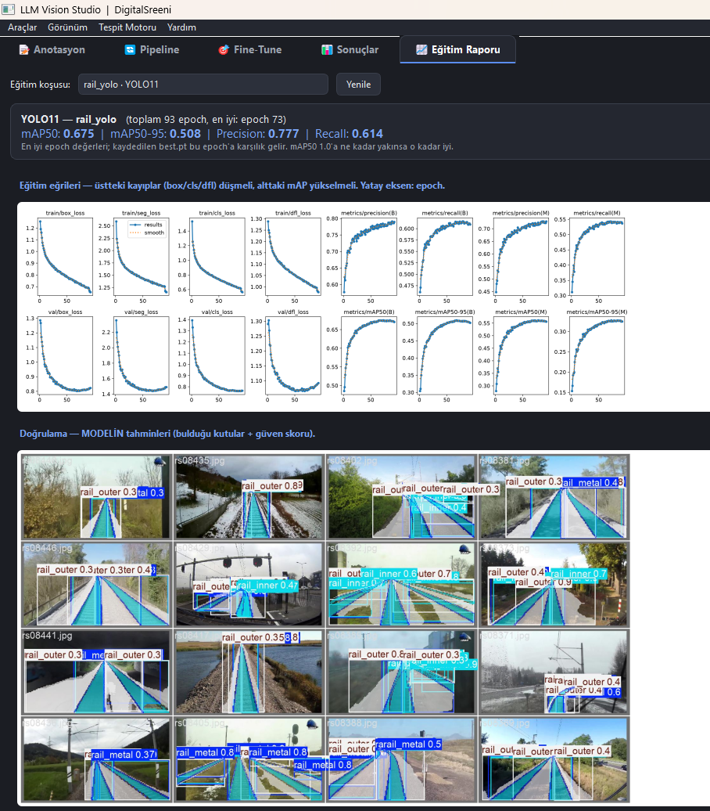
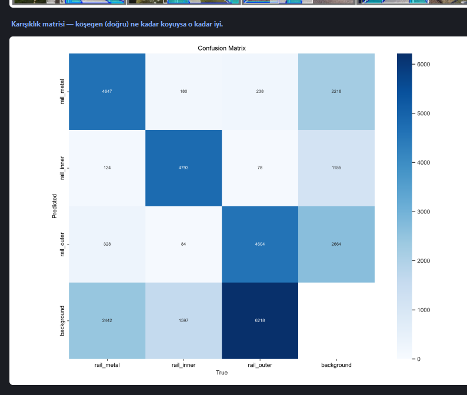
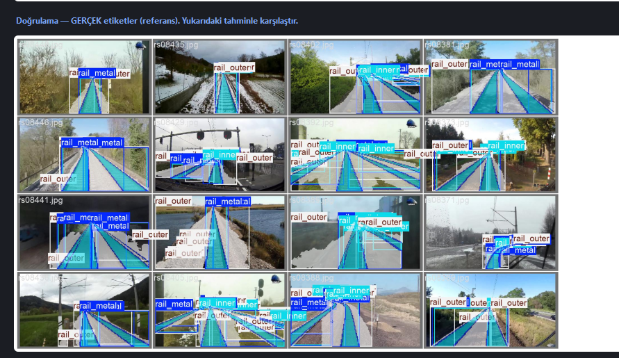

__Günlük Çalışma Raporu__

Tarih: 29 Temmuz 2026  |  Hazırlayan: Durhasan

__Konu: Spesifikasyonların Koda Dökülmesi, RailSem19 Segmentasyon Eğitimi ve YOLO Entegrasyonu__

Bugün önceki günlerde hazırladığım canvas, YOLO ve birleşik araç spesifikasyonlarını koda döktüm\. Günün ağırlıklı çalışması tren rayı tespiti projesi oldu: RailSem19 veri setini YOLO\-seg formatına dönüştürüp ilk segmentasyon modelini eğittim ve sonuçları analiz ettim\.

__Yapılan İşler__

__1\. Spesifikasyonların Koda Dökülmesi__

Önceki günlerde tasarladığım üç spesifikasyonu çalışan koda dönüştürdüm: canvas iyileştirmeleri \(sığdırma modları, döndürme, zoom, HUD\) annotator\.py'ye entegre edildi\. YOLO desteği bağımsız bir modülde \(yolo\_tools\.py\) toplandı — DetectionEngine soyut sınıfı ve üç motor \(Grounding DINO, YOLO\-World, YOLO11\)\. Fine\-Tune sekmesine YOLO11 eğitim bölümü ve hazır dataset\.yaml desteği eklendi\.

__2\. RailSem19 → YOLO\-seg Dönüşümü ve Model Eğitimi__

Tren rayı tespiti projesi kapsamında RailSem19 veri setinin uint8 semantik segmentasyon maskelerini YOLO\-seg poligon formatına dönüştüren railsem19\_to\_yolo\.py scriptini yazdım\. Script, her maske pikselinden hedef sınıfları çıkarıp OpenCV ile kontur buluyor, poligonları YOLO formatında normalize ediyor ve train/val/test olarak bölerek dataset\.yaml üretiyor\. İlk eğitimi YOLO11n\-seg \(nano\) ile 93 epoch boyunca gerçekleştirdim\.

__3\. Eğitim Sonuçları ve Analiz__

Model doğrulama setinde mAP50: 0\.675, mAP50\-95: 0\.508, Precision: 0\.777, Recall: 0\.614 değerlerine ulaştı\. Eğitim eğrileri, karışıklık matrisi ve tahmin örnekleri aşağıda yer almaktadır\.

*Eğitim eğrileri ve metrikler \(en iyi epoch: 73\)*

*Karışıklık matrisi — rail\_inner güçlü, rail\_outer→background karışıklığı ana sorun*

*Doğrulama görüntüleri — gerçek etiketler \(referans\)*

__4\. Tespit Edilen Metodolojik Sorunlar ve Düzeltmeler__

Sonuçları incelerken iki sorun tespit ettim\. Birincisi, dönüşüm scripti sınıfların yalnızca üçünü çıkarıyordu — ekibin belirlediği beş sınıfa \(rail\-raised, rail\-track, trackbed, rail\-embedded, tram\-track\) güncelledim\. İkincisi, veri test seti ayırmadan 80/20 bölünmüştü — ekibin standardı olan 70/15/15 train/val/test bölmesine geçtim\. Sınıf piksel\-ID eşlemesini rs19\-config\.json dosyasına karşı teyit ettim\. Düzeltilmiş veriyle model yeniden eğitiliyor\.

__Sonuç ve Sonraki Adımlar__

Tasarım spesifikasyonları koda döküldü ve RailSem19 ile ilk segmentasyon eğitimi tamamlandı\. Sonraki adımlarda düzeltilmiş 5 sınıf ve 70/15/15 bölmeyle modeli yeniden eğitmeyi, daha büyük model boyutuyla \(small/medium\) performansı artırmayı ve test setinde nihai değerlendirme yapmayı planlıyorum\.

__Kullanılan Teknolojiler__

Python 3\.12, PyTorch 2\.11\+cu128, Ultralytics \(YOLO11\-seg, YOLO\-World\), HuggingFace Transformers, PyQt5, OpenCV, RailSem19

