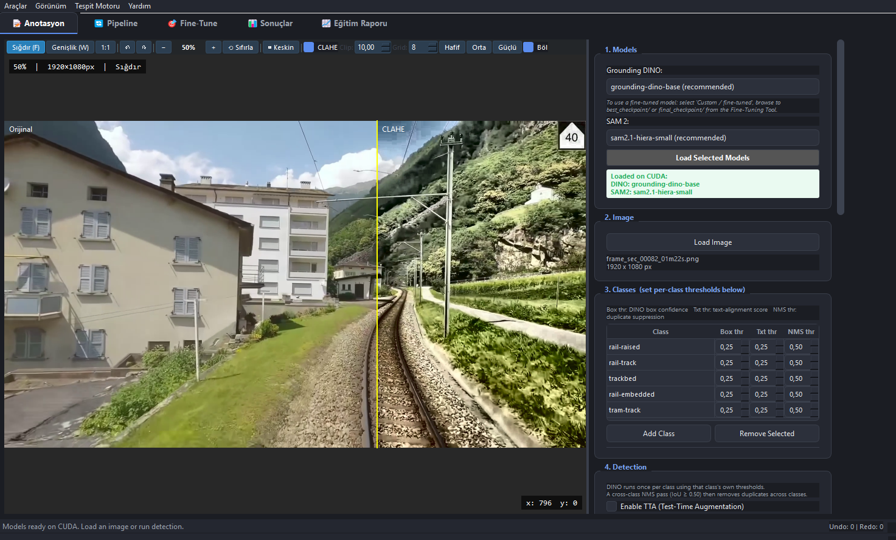
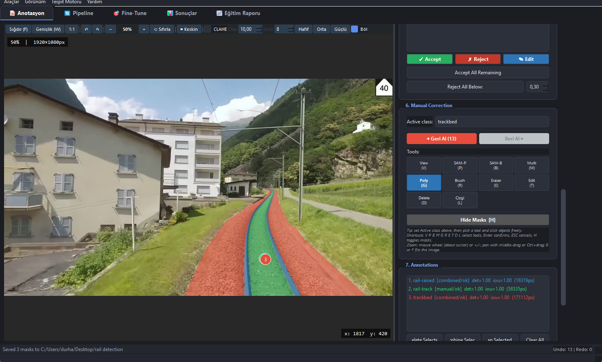

# Gün 11 - Günlük Çalışma Raporu

**Tarih:** 3 Ağustos 2026  
**Konu:** CLAHE Entegrasyonu, COCO Export Kalite Analizi ve Ray Etiketleme Çalışması  

---

## Günün Özeti

Bugün üç ana çalışma yürüttüm: CLAHE kontrast iyileştirmesini anotasyon aracına entegre ettim, arkadaşımın test sırasında karşılaştığı tırtıklı maske sorununu analiz edip geçici çözüm uyguladım ve tren rayı projesi için video frame'lerini etiketlemeye devam ettim.

---

## Yapılan İşler

### 1. CLAHE Kontrast İyileştirmesi Entegrasyonu
CLAHE (Contrast Limited Adaptive Histogram Equalization) özelliğini anotasyon aracına entegre ettim. Özellik LAB renk uzayında sadece parlaklık (L) kanalını işleyerek renk bilgisini korurken kontrastı lokal olarak artırıyor. 

Entegrasyon şu bileşenleri kapsıyor: 
- `Ctrl+H` kısayoluyla açılıp kapanabilen canlı görüntüleme
- Clip limit ve grid size parametreleri için ayar paneli
- Hafif/Orta/Güçlü preset butonları
- Tespit öncesi CLAHE ön-işleme seçeneği (DINO/YOLO'ya CLAHE'li görüntü gönderilirken SAM'a orijinal görüntü verilir)
- Yan yana karşılaştırma (split view) modu

Grayscale görüntü desteği, `QSettings` ile ayar kalıcılığı ve bellek-güvenli `QImage` dönüşümü gibi sağlamlık iyileştirmeleri de eklendi. Henüz test edilmedi, yarın gerçek veriler üzerinde değerlendirilecek.

*(CLAHE entegrasyonunu gösteren ekran görüntüsü)*

### 2. COCO Export Poligon Kalite Sorunu ve Analizi
Arkadaşım etiketlediğim frame'leri test ederken maskelerin tırtıklı ve çizgi çizgi göründüğünü bildirdi. Export edilen COCO JSON dosyasını incelediğimde sorunun kaynağını tespit ettim: mask-to-polygon dönüşümünde `approxPolyDP` fonksiyonu çok agresif sadeleştirme yapıyor. 

1920x1080 piksellik eğri bir ray yapısı için yalnızca 12-30 poligon noktası üretiliyor, oysa bu boyuttaki eğriler için en az 100-200 nokta gerekli. Düz çizgi segmentleri arasındaki geçişler tırtıklı görünüme neden oluyor. 

**3 çözüm yolu belirlendi:** 
1. Epsilon değerini düşürmek (daha fazla poligon noktası)
2. COCO RLE encoding kullanmak (piksel bazlı kayıpsız)
3. PNG mask dosyalarını kullanmak

**Geçici çözüm:** Arkadaşıma PNG mask dosyalarını kullanmasını söyledim – test sonuçları belirgin şekilde daha iyi çıktı çünkü PNG maskeler piksel bazlı ve kayıpsız.

### 3. Tren Rayı Frame Etiketleme
Geri kalan zamanı tren rayı video frame'lerini etiketlemeye ayırdım. LLM Vision Studio'daki anotasyon aracını kullanarak frame'leri üç sınıfta (`rail-raised`, `rail-track`, `trackbed`) etiketledim. Poly, Brush ve Çizgi (taper) araçlarını birlikte kullanarak maskeleri oluşturdum. Etiketlenen verileri COCO JSON ve PNG mask formatlarında export ettim.

*(Anotasyon ve etiketleme çalışmasını gösteren ekran görüntüsü)*

---

## Sonuç ve Sonraki Adımlar

CLAHE entegrasyonu tamamlandı ve teste hazır. COCO export kalite sorunu tespit edilip geçici çözüm (PNG maskeler) uygulandı. 

Sonraki adımlarda CLAHE'yi gerçek veriler üzerinde test etmeyi, export fonksiyonundaki epsilon değerini kalıcı olarak düzeltmeyi, isteğe bağlı RLE encoding desteği eklemeyi ve etiketleme çalışmasına devam etmeyi planlıyorum.

---

## Kullanılan Teknolojiler
`Python 3.12`, `OpenCV (CLAHE, LAB renk uzayı, approxPolyDP, findContours)`, `PyQt5`, `NumPy`, `COCO JSON formatı`, `LLM Vision Studio`

---

## Üretilen Çıktılar
- `clahe_entegre.png` — CLAHE entegrasyonu split-view görüntüsü
- `etiket.png` — Tren rayı etiketleme ekran görüntüsü
- Güncellenmiş etiketlenen COCO JSON ve PNG mask veri seti

---
[Ana Sayfaya Geri Dön](../README.md) | [Gün 10 Raporu](../Day10/README.md)
 
---
*Hazırlayan: Durhasan*
