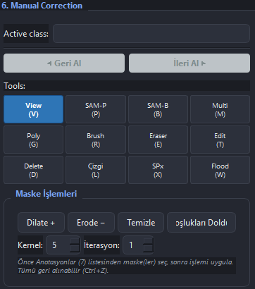
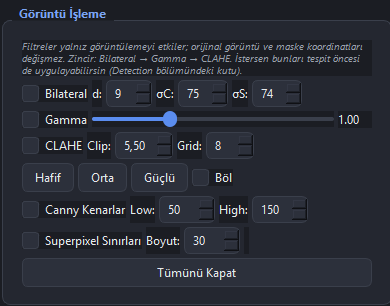

# Gün 15 - Günlük Çalışma Raporu

**Tarih:** 7 Ağustos 2026  
**Konu:** Görüntü İşleme Entegrasyonunun Tamamlanması, İyileştirmeler ve Doğrulama Çalışmaları

---

## Günün Özeti

Bugün, dün başladığım `annotator.py` aracına yeni görüntü işleme özelliklerinin entegrasyonu sürecini tamamen bitirdim. Eksik özellikleri ekledim, bazı davranışları iyileştirdim (Boşlukları Doldur düzeltmesi, ön-işleme mantığı, CLAHE'nin taşınması vb.) ve eklenen tüm özelliklerin uçtan uca doğrulamalarını başarıyla gerçekleştirdim.

---

## Yapılan İşler

### 1. Sonradan Yapılan İyileştirmeler

- **"Boşlukları Doldur" Davranış Düzeltmesi:**
  - Eskiden uygulanan Closing (genişlet→daralt) kaldırıldı; artık yalnız kapalı iç delikler dolduruluyor ve dış sınır birebir korunuyor (büyük kernelde bile şekil bozulmuyor).
- **Tespit Öncesi Görüntü İşleme:**
  - Detection bölümüne **"Tespit öncesi görüntü işlemeyi uygula"** kutusu eklendi (eski CLAHE kutusunun yerine).
  - İşaretlendiğinde panelde açık olan filtre zinciri (Bilateral → Gamma → CLAHE) DINO girişine uygulanır.
  - Maske her zaman orijinalde üretilir, kutular orijinale tam oturur. Canny/Superpixel overlay'leri bu işleme dahil edilmez.
- **CLAHE'nin Panele Taşınması:**
  - CLAHE kontrolleri (Clip/Grid, Hafif/Orta/Güçlü ön ayarları ve Böl seçeneği) üst araç çubuğundan sol paneldeki "Görüntü İşleme" grubuna taşındı, Bilateral ve Gamma ile bir araya getirildi.

### 2. Mimari Kararlar ve Kısayol Güncellemeleri

- **Overlay Render Yöntemi:** Bu canvas `crop + scale` çizdiği için overlay'ler orijinal uzayda bool maske olarak tutulup mevcut `_draw_mask_overlay` ile çiziliyor. Böylece rotasyon / zoom / pan işlemleri otomatik çalışıyor.
- **Klavye Kısayolları:**
  - `Ctrl+K`: Bilateral
  - `Ctrl+G`: Gamma
  - `Ctrl+J`: Canny Overlay
  - `X`: Superpixel Fırçası
  - `W`: Flood Fill *(Eski genişliğe sığdır davranışı `Shift+W` kısayoluna taşınarak çakışma çözüldü)*
- **Filtre Cache'i:** Ortak zincir cache'i oluşturuldu. Herhangi bir filtre değiştiğinde tüm zincir ve Canny kaynağı bayatlar (eski CLAHE-only bug'ı da giderildi).

### 3. Kullanıcı Arayüzü ve Paneller

Aşağıda sisteme entegre edilen iki yeni bölüm görünmektedir:

  
*(Morfolojik işlemlerin bulunduğu "Maske İşlemleri" alanı - Manual Correction paneli altında)*

  
*(Bilateral, Gamma, CLAHE ve diğer özelliklerin bir araya toplandığı "Görüntü İşleme" paneli)*

### 4. Doğrulama ve Kullanım Senaryoları

Tüm testler (Smoke, Regresyon vb.) offscreen (headless) olarak çalıştırıldı ve geçti:
- **Gerçek DINO Ölçümleri:** Yerel model (`grounding-dino-tiny`) ile testler yapıldı. Görüntü ön-işlemenin DINO çıktısını gerçekten değiştirdiği, kutu sayısı ve skorlara doğrudan etki ettiği doğrulandı.
- **Kullanım Önerileri Belirlendi:**
  - **Gündüz / Net:** Ön-işleme çoğunlukla gereksiz.
  - **Gece / Karanlık:** Gamma (2.0-2.5) ve CLAHE (Güçlü) kullanımı etiketleme ve tespit için kritik.
  - **Gürültülü:** Kenar koruyarak pürüzsüzleştiren Bilateral kullanılması önerildi.

---

## Sonuç

`annotator.py` içerisine hedeflenen tüm görüntü işleme özellikleri (7 yeni araç) tek dosyada, mevcut fonksiyonları bozmadan entegre edildi. Filtreleme ile ön-işleme, yapay zeka tespiti öncesi kullanılabilecek kararlı bir hale getirildi. 

---
*Hazırlayan: Durhasan*
