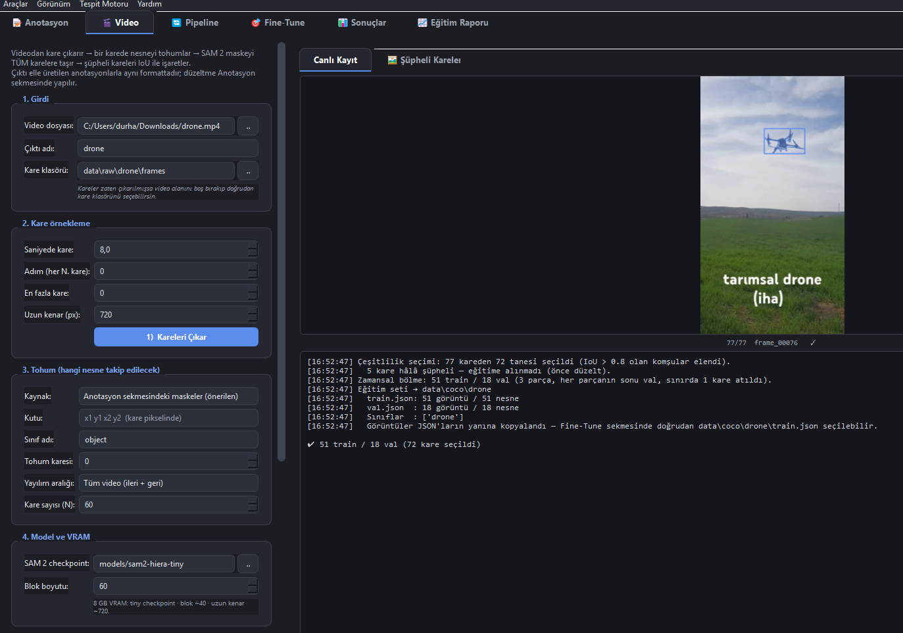
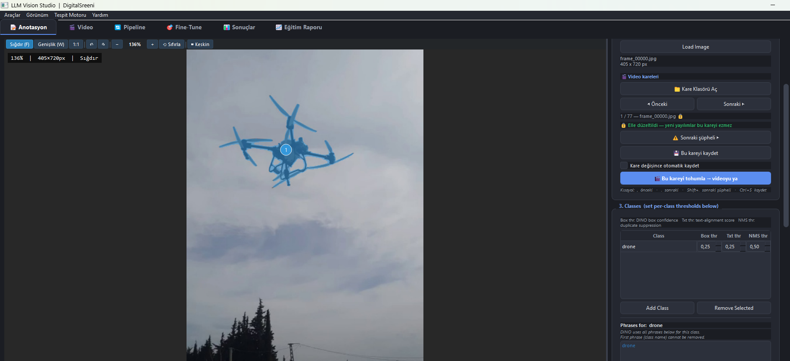
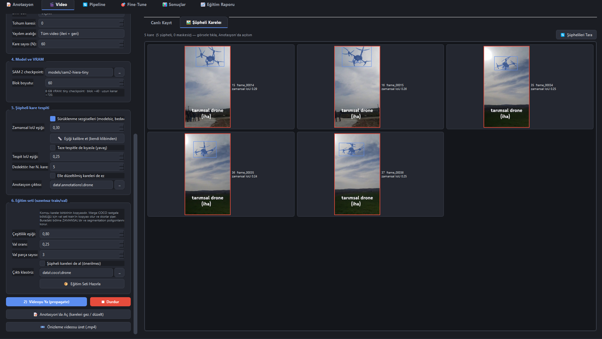

# Gün 17 - Günlük Çalışma Raporu

**Tarih:** 11 Ağustos 2026  
**Konu:** SAM 2 Video Entegrasyonunun Araca Kodlanması ve Video Anotasyon Hattının Uçtan Uca Tamamlanması

---

## Günün Özeti

Dün planlamasını ve model testlerini bitirdiğim video anotasyon özelliğini bugün araca kodladım. Artık bir videodan kare çıkarıp tek bir karede nesneyi işaretlemek, SAM 2'nin bu maskeyi tüm karelere taşıması ve ortaya çıkan verinin mevcut model eğitimi hattına doğrudan girmesi mümkün. Temel çalışma bittikten sonra kullanım sırasında ortaya çıkan eksikleri de tamamladım: takibin bozulduğu kareleri otomatik yakalayan bir kontrol mekanizması, yapılan düzeltmelerin kaybolmasını önleyen koruma, işlemi canlı izlemeyi sağlayan görsel paneller ve model eğitimi için dürüst bir veri bölme yöntemi ekledim. Günün sonunda gerçek bir drone videosuyla uçtan uca deneme yaptım ve eğitim setini başarıyla ürettim.

---

## Yapılan İşler

### 1. Yeni Modül ve Video Sekmesi

- Tüm video mantığı `video_tools.py` adında **yeni ve bağımsız bir dosyaya** yazıldı. Arayüz kodu içermiyor, komut satırından tek başına da çalışabiliyor.
- Araca **"🎬 Video"** sekmesi eklendi: video seçme, kare çıkarma, takibi başlatma ve çıktı klasörlerinin otomatik belirlenmesi bu ekranda yapılıyor.

  
*(Yeni "Video" sekmesi: sol tarafta kare çıkarma ve takip ayarları, sağ tarafta canlı önizleme ve işlem kaydı)*

### 2. Anotasyon Ekranına Kare Gezinme Eklenmesi

Videodan çıkan kareler mevcut anotasyon ekranında açılıp düzeltilebiliyor:

- Kare klasörü açma, **◀ Önceki / Sonraki ▶** düğmeleri ve sayaç.
- Klavye kısayolları: `,` önceki, `.` sonraki, `Shift+.` sonraki şüpheli kare, `Ctrl+S` kaydet.
- Bir kare açıldığında o kareye ait maskeler diskten geri okunuyor; şüpheli olanlar mevcut **Confidence Review** paneline düşüyor, böylece kullanıcı sadece sorunlu kareleri düzeltiyor.
- **"🎬 Bu kareyi tohumla → videoyu ya"** düğmesiyle takip doğrudan anotasyon ekranından başlatılabiliyor.

  
*(Anotasyon ekranına eklenen "Video kareleri" bölümü — kare gezinme, kaydetme ve tohumlama düğmeleri)*

### 3. Takip Bozulmalarının Otomatik Yakalanması

Video takibinde en büyük risk **sürüklenme (drift)**: model bir karede şaşırırsa hatayı sonraki karelere de taşıyor ve kendi kendine düzeltemiyor. Bunu yakalamak için model gerektirmeyen, hızlı bir kontrol yazdım:

- **Zamansal tutarlılık:** Ardışık iki karenin maskeleri arasındaki gerçek piksel örtüşmesi ölçülüyor. Ani düşüş "başka bir nesneye atladı" demek.
- **Alan sıçraması:** Maske alanı son karelerin ortalamasına göre iki kattan fazla değiştiyse işaretleniyor.
- **Merkez atlaması:** Nesnenin ağırlık merkezi bir adımda görüntünün önemli bir kısmı kadar yer değiştirdiyse işaretleniyor.
- **Kenar teması / maske kaybı:** Nesne kare dışına çıkıyorsa veya maske tamamen kaybolduysa o kare ayrıca işaretleniyor.

Ayrıca eşiği tahminle değil ölçümle belirlemek için **"Eşiği kalibre et"** düğmesi eklendi: kendi videonuzun ölçümlerini çıkarıp hangi eşiğin kaç kareyi işaretleyeceğini gösteriyor ve bir değer öneriyor.

### 4. Yapılan Düzeltmelerin Korunması

Kullanıcı bir kareyi elle düzeltip kaydettiğinde o kare **kilitleniyor (🔒)**. Sonradan takip yeniden çalıştırılsa bile bu kareler üzerine yazılmıyor. Böylece saatlerce yapılan düzeltmeler tek bir yeniden çalıştırmayla kaybolmuyor. İsteyen kullanıcı bu korumayı bilinçli olarak kapatabiliyor.

Bunun yanında kaydedilmemiş değişiklikle başka kareye geçilmek istendiğinde uyarı veriliyor ve dileyene otomatik kaydetme seçeneği sunuluyor.

### 5. Görsel Geri Bildirim

İşlemin ne yaptığını sayılardan değil gözle takip edebilmek için üç ekleme yapıldı:

- **Canlı önizleme:** İşlenen kare, maskesi üzerine bindirilmiş şekilde anlık gösteriliyor; şüpheli kareler kırmızı, maskesiz kareler turuncu çerçeveli.
- **Şüpheli kareler galerisi:** İşlem bitince tüm sorunlu kareler küçük görseller hâlinde listeleniyor. Bir görsele tıklandığında anotasyon ekranı açılıp o kare yükleniyor.
- **Önizleme videosu (.mp4):** Tüm sonucun maskeli hâli tek bir video olarak üretilebiliyor; yüzlerce kareyi tek tek gezmeden sorunun nerede başladığı görülebiliyor.

Ayrıca işlem kaydı (log) zenginleştirildi: her kare için maske alanı, tutarlılık değeri ve varsa şüphe gerekçesi yazılıyor; ayrıca hız ve tahmini kalan süre gösteriliyor.

### 6. Model Eğitimi İçin Veri Bölme (Sızıntı Sorunu)

Video karelerinin komşuları birbirinin neredeyse kopyası olduğu için, verinin **rastgele** train/val ayrılması ciddi bir ölçüm hatası doğuruyor: aynı görüntünün bir kopyası eğitime, diğeri doğrulamaya düşüyor ve başarı puanı olduğundan yüksek çıkıyor. Bunu önlemek için ayrı bir bölme yöntemi yazıldı:

- **Çeşitlilik seçimi:** Birbirine çok benzeyen komşu kareler eleniyor, yalnızca gerçekten farklı kareler alınıyor.
- **Zamansal bölme:** Doğrulama seti videonun bitişik parçalarından alınıyor ve eğitim setinden bir kare boşlukla ayrılıyor, böylece kopya kare sızıntısı olmuyor.
- **Şüpheli kareler eğitime alınmıyor** (insanın onaylamadığı maskeyle eğitim yapmak hatayı modele öğretmek olurdu).
- Ayrıca bu yöntem, mevcut birleştirme aracının düşürdüğü **segmentasyon (piksel maske) bilgisini koruyor**.

  
*(Sol: şüpheli kare tespiti ve eğitim seti ayarları — Sağ: takibin zorlandığı 5 kare, gerekçeleriyle birlikte)*

### 7. Bellek ve Hız İyileştirmeleri

- **8 GB VRAM için bloklu çalışma:** Kareler bloklar hâlinde işleniyor, bloklar bir kare örtüşerek devrediyor, böylece takip kopmadan bellek sınırında kalınıyor.
- **Akışlı yazım:** Üretilen her kare anında diske yazılıyor; tüm videonun belleğe sığması gerekmiyor ve sonuçlar iş sürerken incelenebiliyor.
- **Aralık sınırı:** Sürüklenmenin başladığı kare düzeltildikten sonra "bu kareden ileri" seçeneğiyle yalnızca bozuk kısım yeniden üretilebiliyor.
- İki modelin aynı anda bellekte olmaması için sıralama düzenlendi (SAM 2 boşaltıldıktan sonra kontrol aşamasına geçiliyor).

### 8. Uçtan Uca Doğrulama

- Çıktı biçiminin elle üretilen anotasyonlarla **birebir aynı** olduğu doğrulandı; mevcut birleştirme ve eğitim hattı hiç değiştirilmeden çalıştı.
- Üretilen verinin hem **Grounding DINO** hem **YOLO** eğitim yollarında okunabildiği ayrı ayrı test edildi.
- **Gerçek deneme (drone videosu):** 77 kare çıkarıldı, tek bir karede işaretlenen drone tüm karelere taşındı. Sistem yalnızca **5 kareyi** şüpheli işaretledi (%6,5 — hedeflenen aralıkta). Çeşitlilik seçimi 72 kareyi ayırdı ve **51 eğitim / 18 doğrulama** görüntülük veri seti üretildi.

### 9. Karşılaşılan Sorunlar ve Çözümleri

- **Kısayol çakışması:** Planlanan `A`/`D` tuşlarından `D`, mevcut araçta "silme" aracına atanmıştı; sessizce bozulmaması için gezinme `,` ve `.` tuşlarına alındı.
- **Birleştirme aracıyla uyum:** Mevcut birleştirme aracı her dosyadan yalnızca ilk kareyi okuduğu için, çıktı kare başına ayrı dosyalar hâlinde yazıldı; birleşik dosya ise farklı bir adla üretilerek karışıklık önlendi.
- **Hatalı "1.00" gösterimi:** Panellerde tüm maskelerin güven değeri 1.00 görünüyordu; ölçüm değerinin panele taşınmadığı tespit edilip düzeltildi.
- **Uygulamanın kendiliğinden kapanması:** Görsel önizleme kodunda, görüntü verisinin belleğe kopyalanmadan kullanılmasından kaynaklanan bir hata bulundu ve giderildi. Ayrıca ileride benzer bir durumda uygulamanın sessizce kapanmaması için hata yakalama mekanizması eklendi; hatalar artık ekranda gösteriliyor ve `studio_hata.log` dosyasına kaydediliyor.

---

## Sonuç

Video anotasyon özelliği araca tamamen entegre edildi ve gerçek bir video üzerinde uçtan uca çalıştığı doğrulandı. Daha önce her kareyi tek tek elle işaretlemek gerekirken artık tek bir karede yapılan işaretleme tüm videoya taşınıyor, sistem yalnızca şüpheli kareleri kullanıcının önüne getiriyor ve ortaya çıkan veri doğrudan model eğitimine hazır hâle geliyor. Mevcut dosyaların hiçbirine dokunulmadığı için aracın önceki tüm özellikleri korundu.

**Sonraki adım:** Yapılan yeniliklerin test edilmesi ve gerekirse iyileştirmeler ve düzenlemeler yapılması.

---
*Hazırlayan: Durhasan*
