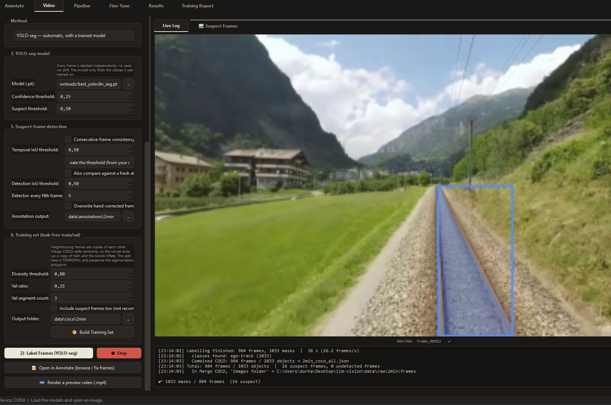

# Gün 18 - Günlük Çalışma Raporu

**Tarih:** 12 Ağustos 2026  
**Konu:** Eğitilmiş YOLO-seg Modeliyle Otomatik Etiketleme ve Aktif Öğrenme Döngüsünün Kapanması

---

## Günün Özeti

Dün araca eklediğim video anotasyon özelliği, sınıf için henüz eğitilmiş bir model yokken çalışan bir yöntemdi: kullanıcı tek bir karede nesneyi işaretliyor, SAM 2 bunu tüm karelere taşıyordu. Bugün döngünün bir sonraki halkasını ekledim: **eğitilmiş bir model varsa işaretlemeye hiç gerek kalmıyor**, model kareleri kendisi etiketliyor. Etiketlenen karelerin bir kısmı şüpheli olarak işaretlenip kullanıcıya gösteriliyor. İstenirse kullanıcı manuel olarak düzeltebiliyor. Ayrıca iki yöntemin maske kalitesini ölçerek karşılaştırdım ve mevcut ray modellerinin gerçekte neyi bölütlediğini inceledim.

---

## Yapılan İşler

### 1. YOLO-seg ile Otomatik Etiketleme

Video sekmesine bir **"Yöntem"** seçici eklendi: *SAM 2 Video (tohumla)* ya da *YOLO-seg (otomatik)*. YOLO seçildiğinde tohum ayarları yerini model dosyası ve güven eşiklerine bırakıyor; kullanıcının tek yapması gereken eğitilmiş modeli seçmek.

Çıktı biçimi iki yöntemde de **tamamen aynı** — aynı maske dosyaları, aynı COCO çıktısı, aynı düzeltme ekranı. Yani yöntem değiştiğinde sonraki adımların hiçbiri değişmiyor.

Kareler birbirinden bağımsız işlendiği için **sürüklenme (drift) sorunu tamamen ortadan kalkıyor**; dün bunu yakalamak için yazdığım kontrol mekanizmasına burada gerek kalmıyor. Model ayrıca tek bir nesneyle sınırlı kalmayıp karedeki tüm nesneleri buluyor.

  
*(2 dakikalık ray videosu: 984 kare, 1033 maske, 38 saniye — sağda canlı önizleme ve işlem kaydı)*

**Gerçek koşu sonucu:** 984 karelik bir ray videosu **38 saniyede** etiketlendi (saniyede 26,2 kare). 1033 maske üretildi, yalnızca **16 kare** şüpheli işaretlendi, tespitsiz kare olmadı.

### 2. Şüpheli Kare Tespitinin Uyarlanması

Şüpheli kare ölçütü yeni yönteme uyarlandı: sürüklenme olmadığı için ölçüt artık **modelin güven skoru**. Eşiğin altında kalan maskeler düzeltme paneline düşüyor, hiç tespit yapılamayan kareler ayrıca işaretleniyor. Model kare arası kimlik vermediğinden, ardışık karelerdeki maskeleri örtüşmelerine göre eşleştiren basit bir yöntemle nesnelerin numarası video boyunca korunuyor.

### 3. İki Yöntemin Karşılaştırılması (Ölçüm)

"YOLO'nun maskeleri SAM 2 kadar keskin olmaz" diye bir beklentim vardı. Bunu varsayım olarak bırakmayıp, iki yöntemin de aynı nesneyi hedeflediği bir klipte ölçtüm:

| Ölçüm | Sonuç |
|---|---|
| İki yöntemin maskeleri arasındaki örtüşme (IoU) | **0,937** |
| Sınır pürüzlülüğü (çevre²/alan) | SAM 2: 20,3 — YOLO: **19,0** |
| Hız | SAM 2 ≈ 1,6 kare/sn — YOLO **26,2 kare/sn** |

Sonuç beklentimin aksine çıktı: maskeler neredeyse aynı, hatta YOLO'nun sınırı bir miktar daha düzgün. Yani kalite kaygısıyla yavaş yöntemi tercih etmek için bir sebep yok.

Ayrıca önemli bir teknik ayrıntı yakalandı: kütüphane maskeleri varsayılan olarak modelin iç boyutunda döndürüyor, oysa karemiz farklı boyutta. Fark edilmeseydi tüm maskeler kaymış kaydedilecekti; ilgili ayar açılarak orijinal çözünürlükte alınması sağlandı.

### 4. Ray Modelleri ve Değerlendirilen Alternatifler

Mevcut iki ray modelini inceledim: ikisi de yüksek güvenle çalışıyor, ancak **ray hattının bölgesini** işaretliyorlar (koridor, balast alanı), ince çelik ray çizgilerini değil. Bu, eğitildikleri veri kümesinin semantiğinden kaynaklanıyor ve sonraki adımı doğrudan belirliyor: hedef bölge maskesi ise sistem hazır, ince çizgi ise önce SAM 2 ile bir etiketleme turu gerekiyor.

Otomatik etiketleme için dört yaklaşım daha değerlendirdim (YOLO kutusunu SAM 2 ile maskelemek, takip algoritması eklemek, YOLO maskesini SAM 2'ye tohum vermek gibi). Yapılan ölçümler bunların gerekçesini ortadan kaldırdı — maske kalitesi farkı çıkmadı, nesne kimliği zaten çözüldü. Gereksiz kod yazmak yerine bu yaklaşımlar gerekçeleriyle not edilip bırakıldı.

---

## Sonuç

Aracın aktif öğrenme döngüsü tamamlandı: model yokken SAM 2 Video ile veri üretiliyor, eğitilmiş bir model ile sonra aynı iş otomatik ve yaklaşık **on altı kat hızlı** yapılabiliyor. İki yöntem aynı çıktıyı ürettiği için geçiş yapıldığında sonraki hiçbir adım değişmiyor. Yapılan ölçümler bir varsayımı düzelterek gereksiz geliştirmeyi de önledi.

---
*Hazırlayan: Durhasan*
