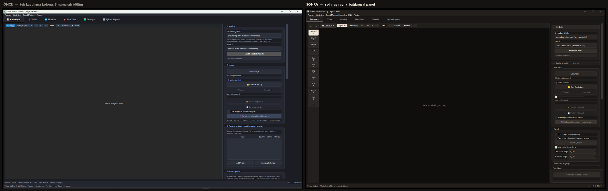
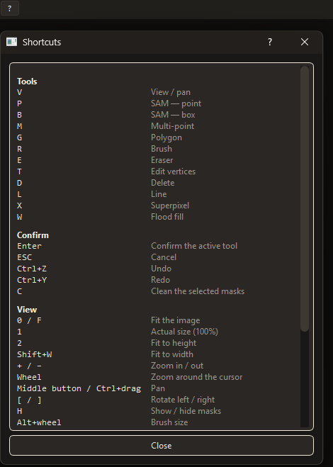

# Gün 19 - Günlük Çalışma Raporu

**Tarih:** 13 Ağustos 2026  
**Konu:** Anotasyon Aracının Arayüzünün Yeniden Düzenlenmesi ve Görsel Kimliğin Kurulması

---

## Günün Özeti

Son iki haftada araca eklenen yeni özellikler (çoklu sınıf, düzeltme araçları, video anotasyonu vb.) sağ paneli taşma noktasına getirmişti. Tüm kontroller tek bir sütunda yığılmış ve birbiriyle ilişkili araçlar birbirinden uzaklaşmıştı. Bugün arayüzü yeniden düzenleyerek "sol araç rayı + bağlamsal panel" düzenine geçirdim ve görsel kimliği baştan kurdum. Aynı zamanda süreç sırasında tespit edilen hataları giderdim.

---

## Yapılan İşler

### 1. Arayüzün Yeni Düzeni

  
*(Solda önceki hâl: numaralı sekiz bölüm tek kaydırma kolonunda. Sağda yeni hâl: araçlar canvas'ın solunda, kurulum bölümleri katlanmış, tüm panel tek ekranda.)*

Arayüz, kontrollerin tek ekrana sığacağı "sol araç rayı + bağlamsal panel" düzenine geçirildi:

- **Araçlar canvas'ın soluna alındı.** On iki araç, işlevlerine göre üç kümede (seçim · çizim · düzeltme) dikey bir rayda. Kısayol harfleri değişmedi. Ray düğmelerinin odak almaması sağlandı; daha önce tıklanan bir araç düğmesi odağı tutabildiği için Enter/ESC ana pencereye ulaşmayabiliyordu.
- **Panel bağlamsal hale geldi.** Artık yalnız seçili aracın parametrelerini gösteriyor (fırça boyutu, flood toleransı); başlığı da aktif araca göre değişiyor.
- **Maske işlemleri listeye indi.** Genişlet, daralt, boşluk doldur, gürültü at — hepsi listedeki seçime çalıştığı için artık seçimin yanındalar.
- **Görüntü filtreleri canvas çubuğuna taşındı.** On altı kontrollük panel bir açılıra girdi; sürekli filtre ayarlayanlar için panele sabitleme seçeneği var ve bu tercih kaydediliyor.
- **Kurulum bölümleri katlanabilir oldu.** Modeller ve Sınıflar katlandığında tek satıra iniyor ve seçili değerini özet gösteriyor, yani açmadan da neyin ayarlı olduğu görünüyor.
- **Kalıcı açıklama paragrafları kaldırıldı** (sekiz adet); içerikleri anlattıkları kontrolün ipucuna taşındı. Yerlerine `?` ile açılan bir kısayol kartı geldi.
- **Kaydetme düğmesi panelin dibine sabitlendi**, kaydırmadan bağımsız.

  
*(Kalıcı ipucu paragrafları yerine ihtiyaç anında açılan kısayol kartı — beş kümede tüm bağlamalar)*

Ayrıca video karelerinde hızlı gezinmek için **kare sürgüsü (slider)** eklendi. Sürüklerken kasma olmaması için önizlemede yalnızca görüntü yükleniyor, maske okuma yapılmıyor ve istekler 60 ms'de birleştiriliyor.

### 2. Görsel Kimlik Güncellemeleri

Arayüz görsel olarak tamamen yenilenerek dekoratif detaylardan arındırıldı:

- **Kromda dekoratif renk kalmadı.** Vurgu artık bir renk değil, parlaklık: aktif araç ve birincil eylem açık dolgu ile ayrışıyor.
- **Doygun renk yalnız anlam taşıyor.** Ekranda gördüğün her canlı renk bir duruma karşılık geliyor. Bu ilkeyi uygularken anlam taşımayan renkli düğmeler nötrleştirildi — örneğin geri/ileri al düğmeleri kırmızı ve yeşildi, oysa geri almak bir eylem, durum değil.
- **Canvas en koyu yüzey yapıldı.** Daha önce panelle neredeyse aynı parlaklıktaydı ve üzerinde çalışılan görüntü öne çıkmıyordu.
- **Hiyerarşi renkle değil formla kuruldu:** başlıklar küçük punto ve kalın, italik açıklamalar kaldırıldı.
- **Sayılar tek aralıklı yazıya alındı.** Skorlar, eşikler, IoU değerleri artık alt alta hizalanıyor; bu uygulamada en çok taranan şey skor sütunu olduğu için gözle karşılaştırma kolaylaştı.

### 3. Giderilen Hatalar

Süreç sırasında tespit edilen hatalar da düzeltildi:

| Hata | Kökeni |
|---|---|
| Fare tekerleği ayarları sessizce bozuyordu | Bu widget'ların varsayılan odak politikasında **tekerleğin kendisi odağı veriyor**; bu yüzden "odaklanmış mı" kontrolü tek başına işe yaramıyordu. Ölçüldü: düzeltmeden önce panelde kaydırmak bir filtre değerini 75'ten 55'e düşürüyordu ve bu değer kayıtlı ayarlara yazılıyordu. |
| Ayar yükleme sırası, okunmamış ayarları eziyordu | Ayarları yüklerken tetiklenen kaydetme, henüz okunmamış ayarın üzerine varsayılanı yazıyordu. Yalnız yeni ayarı değil, **ileride eklenecek her ayarı** etkileyecek bir sıra hatasıydı. |
| "Yazı Boyutu" menüsü hiçbir şey yapmıyordu | Menü uygulama fontunu değiştiriyordu ama stil sayfasındaki boyutlar mutlak; onu eziyorlardı. Stil sayfası artık ölçek çarpanıyla yeniden üretiliyor. |

Bunlara ek olarak: açılır panelin kendi düğmesiyle kapanmaması, bir hata yakalayıcının açılışta görünmez bir uyarı kutusu açması, sekme etiketlerinin kırpılması ve yeni palette devre dışı düğmelerin okunamaz hale gelmesi düzeltildi.

---

## Sonuç

Arayüz artık tek ekrana sığıyor: araçlar üzerinde çalışılan görüntünün yanında, her kontrol etkilediği nesnenin bitişiğinde yer alıyor. Görsel kimlik sadeleştirildi ve renkler anlam taşıyacak şekilde düzenlendi.

---
*Hazırlayan: Durhasan*
