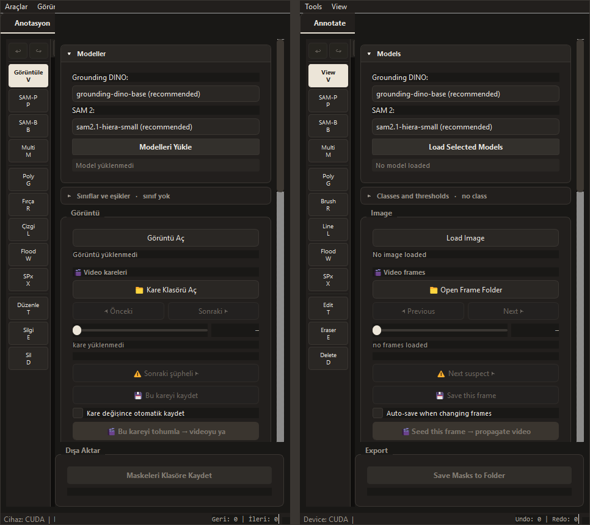

# Gün 20 - Günlük Çalışma Raporu

**Tarih:** 15 Ağustos 2026  
**Konu:** Programa İki Dil Desteği Eklenmesi ve Projenin Kurulabilir Hale Getirilmesi

---

## Günün Özeti

Bugün programa tam kapsamlı iki dil desteği ekledim. Süreç kayıtlarını (logları) teknik kullanım kolaylığı için bilinçli olarak İngilizce sabitledim. Görsel tarafta, Windows başlık çubuğunu uygulamanın koyu temasına dahil ederek pencereyi tek parça hâline getirdim. Son olarak, projenin bağımlılık listesini (requirements.txt) güncelleyip gereksiz dosyaları temizleyerek, projeyi her ortamda kolayca kurulabilir duruma getirdim.

---

## Yapılan İşler

### 1. İki Dil Desteğinin Altyapısı

Program zamanla karışmıştı: bazı paneller Türkçe, bazıları İngilizceydi. İlk plan her şeyi Türkçeleştirmekti; ancak dili sabitlemek yerine **seçenek yapmak** daha doğru bulundu. 

Metinler koda gömülü olduğu için bu, her metnin tek tek bir tabloya taşınmasını gerektirdi. Dil menüden seçiliyor ve kayıtlı kalıyor. Bir kural koydum: **alan terimleri iki dilde de İngilizce kalıyor** (SAM, DINO, NMS, IoU, TTA, CLAHE, checkpoint, epoch, COCO) — bunlar literatürdeki adlarıyla aranan kavramlar, çevirmek yardımcı olmuyor.

### 2. Eksik Çevirilerin Tamamlanması

Programdaki çevrilmemiş tüm metinler eksiksiz bir şekilde çeviri tablosuna eklendi. Bu çalışmanın sonucunda:
- Durum çubuğundaki bildirimler ve araç talimatları,
- Video sayfasındaki formlar, ipuçları ve diyaloglar,
- Pipeline, sonuçlar ve rapor ekranlarındaki grafik açıklamaları,
- Menü, motor seçimi ve araç rayı (canvas çubuğu, filtreler vb.) bileşenleri

başta olmak üzere programın tüm kullanıcı arayüzü tamamen iki dil destekli hâle getirildi.

  
*(Solda Türkçe, sağda İngilizce — program genelinde iki dil desteği mevcut)*

### 3. Kayıt Satırları: Ayrı Bir Karar

Pipeline ve Video panellerinin kayıt (log) alanına akan satırlar karışıktı. Bunları çevirmek yerine **her iki dilde de İngilizce sabitledim**

Gerekçe: bunlar arayüz metni değil, çalışan sürecin çıktısı — kopyalanıp yapıştırılıyor, hata ararken içinde arama yapılıyor ve hata izleriyle yan yana duruyor.

### 4. Başlık Çubuğunun Temaya Alınması

Pencerenin başlık çubuğu Windows'un kendi çizdiği alan olduğu için koyu temanın dışında kalıyor, uygulamanın üstünde beyaz bir şerit olarak duruyordu. `ui_theme.py` içine DWM tabanlı `apply_window_chrome()` ve `install_window_chrome()` eklendi; şerit panel rengine (`#221f1d`) boyandı ve başlık çubuğu menü çubuğuyla tek parça hale geldi.

### 5. Bağımlılıklar ve Proje Temizliği

`requirements.txt` kurulu ortamla eşleşmiyordu: üç paket (ultralytics, opencv-python, matplotlib) hiç yazmıyordu ve sekiz pakette sürüm sapması vardı. Dosya kurulu sürümlerle hizalandı ve 11 paketin tamamı doğrulandı. Projeden izlenen yedi gereksiz dosya (iki toplu iş dosyası, üç belge, iki deneme scripti) ve bayatlamış çıktılar (hata kaydı, eski sonuç klasörü, yarım kalmış checkpoint klasörü, düzenleyici ayarları) çıkarıldı; silinen bir scripte işaret eden üç kırık referans onarıldı.

YOLO ağırlıkları kök dizinden `models/yolo/` altına toplandı ve `yolo_tools.weights_path()` çözücüsü beş çağrı yerine bağlandı. **Dosyaları taşımak tek başına yetmedi:** kütüphane, çıplak bir ağırlık adı verildiğinde onu çalışma dizinine indiriyor, yani klasör bir süre sonra yeniden kirlenecekti. Çözücü bu davranışı da karşıladığı için artık yeni inen ağırlıklar da doğru klasöre düşüyor.

---

## Sonuç

Program artık gerçekten iki dil desteğine sahip: paneller, menüler, ipuçları, diyaloglar ve durum mesajları menüden seçilen dilde geliyor; süreç kayıtları bilinçli olarak İngilizce sabit. Başlık çubuğu da temaya alınınca pencere tek parça göründü. Arayüz çalışması ana koda alındı (toplam 31 commit). Ayrıca proje kurulabilir hale getirildi: bağımlılık listesi kurulu ortamla eşitlendi, gereksiz dosyalar ayıklandı ve model ağırlıkları tek bir klasörde toplandı.

---
*Hazırlayan: Durhasan*
